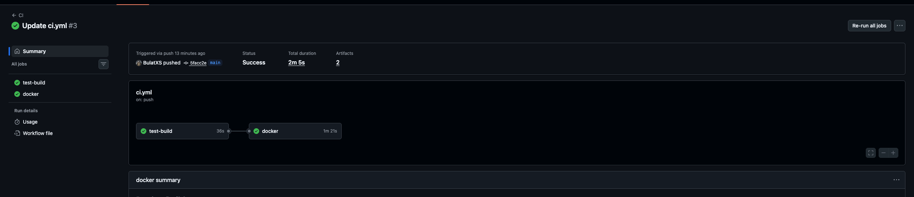

# Практическое занятие №8
# Саттаров Булат Рамилевич ЭФМО-01-25
# Настройка GitHub Actions / GitLab CI для деплоя приложения

---

## 1. Описание

В работе реализован CI/CD pipeline с использованием GitHub Actions.

Pipeline автоматически выполняется при каждом push и включает:
- запуск тестов
- сборку сервисов
- сборку Docker-образов
- публикацию образов в GitHub Container Registry (GHCR)

---

## 2. Pipeline (ci.yml)

Файл: `.github/workflows/ci.yml`

Pipeline состоит из двух job:
- test-build — тесты и сборка
- docker — сборка и push образов
```yml
name: CI

on:
  push:
    branches: [ "main", "master" ]
  pull_request:
    branches: [ "main", "master" ]

env:
  GO_VERSION: "1.25"
  REGISTRY: ghcr.io
  IMAGE_AUTH: ghcr.io/${{ github.repository_owner }}/pr8-auth
  IMAGE_TASKS: ghcr.io/${{ github.repository_owner }}/pr8-tasks

jobs:
  test-build:
    runs-on: ubuntu-latest

    steps:
      - name: Checkout repository
        uses: actions/checkout@v4

      - name: Setup Go
        uses: actions/setup-go@v5
        with:
          go-version: ${{ env.GO_VERSION }}

      - name: Verify Go version
        run: go version

      - name: Sync workspace
        run: go work sync

      - name: Run tests for auth
        run: cd services/auth && go test ./...

      - name: Run tests for tasks
        run: cd services/tasks && go test ./...

      - name: Run tests for shared
        run: cd shared && go test ./...

      - name: Build auth
        run: go build ./services/auth/cmd/auth

      - name: Build tasks
        run: go build ./services/tasks/cmd/tasks

  docker:
    runs-on: ubuntu-latest
    needs: test-build
    if: github.event_name == 'push'

    permissions:
      contents: read
      packages: write

    steps:
      - name: Checkout repository
        uses: actions/checkout@v4

      - name: Log in to GHCR
        uses: docker/login-action@v3
        with:
          registry: ghcr.io
          username: ${{ github.actor }}
          password: ${{ secrets.GITHUB_TOKEN }}

      - name: Extract short SHA
        id: vars
        run: echo "sha_short=${GITHUB_SHA::7}" >> $GITHUB_OUTPUT

      - name: Set lowercase owner
        id: owner
        run: echo "owner=$(echo '${{ github.repository_owner }}' | tr '[:upper:]' '[:lower:]')" >> $GITHUB_OUTPUT

      - name: Set up Docker Buildx
        uses: docker/setup-buildx-action@v3

      - name: Build and push auth image
        uses: docker/build-push-action@v6
        with:
          context: .
          file: services/auth/Dockerfile
          push: true
          tags: |
            ghcr.io/${{ steps.owner.outputs.owner }}/pr8-auth:latest
            ghcr.io/${{ steps.owner.outputs.owner }}/pr8-auth:${{ steps.vars.outputs.sha_short }}

      - name: Build and push tasks image
        uses: docker/build-push-action@v6
        with:
          context: .
          file: services/tasks/Dockerfile
          push: true
          tags: |
            ghcr.io/${{ steps.owner.outputs.owner }}/pr8-tasks:latest
            ghcr.io/${{ steps.owner.outputs.owner }}/pr8-tasks:${{ steps.vars.outputs.sha_short }}
```
---

## 3. pipeline

### name
Задаёт имя workflow (CI)

### on
Pipeline запускается:
- при push в main/master
- при pull request

### env
Общие переменные:
- GO_VERSION — версия Go
- REGISTRY — ghcr.io
- IMAGE_AUTH / IMAGE_TASKS — образы

---

## 4. Job test-build

Назначение:
- проверка кода
- запуск тестов
- проверка сборки

Шаги:
- checkout
- setup go
- go work sync
- go test для auth/tasks/shared
- go build auth/tasks

---

## 5. Job docker

Назначение:
- сборка Docker-образов
- публикация в GHCR

Особенности:
- запускается только после test-build
- выполняется только при push

Шаги:
- login в GHCR через GITHUB_TOKEN
- получение short SHA
- приведение owner к lowercase
- docker build + push

---

## 6. Версионирование

Используются теги:
- latest
- short commit hash (например 5facc2e)

Пример:
ghcr.io/bulatxs/pr8-auth:latest
ghcr.io/bulatxs/pr8-auth:5facc2e

---

## 7. Registry

Образы публикуются в GHCR:

docker pull ghcr.io/bulatxs/pr8-auth:latest
docker pull ghcr.io/bulatxs/pr8-tasks:latest

---

## 8. Скриншоты

### Pipeline success


### test-build


### docker push


### auth image


### tasks image


